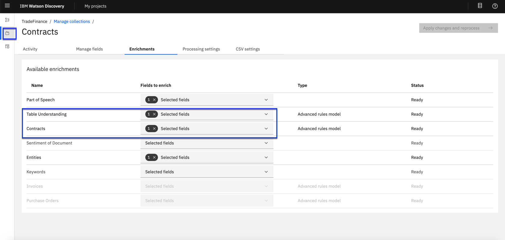

# AI in trade finance with Smart Document Understanding

High volume, repetitive process with rapid turnaround time required – added with small margin of acceptable error.The document screening process encompasses an impossibly diverse range of documents, with inconsistent formats, data structures and varying levels of scan quality. It requires complex document review and validation requirements.

The customers currently do not have an effective way of digitizing the documents via OCR and extracting relevant information. OCR without extraction (related to the correct field, e.g. shipper name) just creates online copies that need to be reviewed.  In addition, template based OCR systems are not effective because of the large number of doc types and variations within a doc type, e.g. every company has different invoice forms.

Using the Watson Discovery, we will enhance the Discovery model so that queries will be better focused to only search the most relevant information. The AI solution brings a complete integrated processing pipeline – leveraging AI capabilities such as cognitive Optical Character Recognition and Natural Language Processing capabilities.

## Watson Discovery

IBM® Watson™ Discovery, an AI search technology that uses innovations in natural language processing, machine learning, and anomaly detection to enable you analyze documents and answers in less time with minimal effort. Watson Discovery to extract custom fields in your documents. Customizing how your documents are indexed into Discovery will improve the answers returned from queries.

With SDU, you annotate fields within your documents to train custom conversion models. As you annotate, Watson is learning and will start predicting annotations. SDU models can also be exported and used on other collections.

Current document type support for SDU is based on your plan:

  * Lite plans: PDF, Word, PowerPoint, Excel, JSON, HTML
  * Advanced plans: PDF, Word, PowerPoint, Excel, PNG, TIFF, JPG, JSON, HTML

Here is a great video that provides an overview of the benefits of SDU, and a walk-through of how to apply it to your document:

[](https://www.youtube.com/watch?v=Jpr3wVH3FVA)

## Flow


# Features - Content Intelligence enrichments

A Discovery for Content Intelligence project has the following default settings:

Settings: Optical Character Reader Advanced on
Enrichments applied: Entities, Parts of speech, Table Understanding, and Contracts
Improvement tools enabled: Facets (by Category, Nature, Contract Term, Contract Payment Term, Contract Type, Contract Currency, Invoice Buyer, Invoice supplier, Invoice Currency, Purchase Order Buyer, Purchase Order Supplier, Purchase Order Payment Term) and Table Retrieval


***IBM Cloud Pak for Data***
The Discovery for Content Intelligence enrichments (Contracts, Invoices, and Purchase orders) are available only if you install Discovery for Content Intelligence.

***IBM Cloud***
On IBM Cloud Premium plans, the Discovery for Content Intelligence Contracts enrichment is available if you choose the Project type of Document retrieval, then select the Apply contracts enrichment checkbox.

# Prerequisite
You will need IBM Cloud Pak for Data instance
# Steps:

1. [Clone the repo](#1-clone-the-repo)
1. [Log into IBM Cloud Pak for Data instance that has Watson Discovery](#2-log-into-ibm-cloud-pak-for-data-instance-that-has-watson-discovery)
1. [Create a new project and import the documents](#3-create-a-new-project-and-import-the-documents)
1. [Understanding Discovery for Content Intelligence enrichments](#4-understanding-discovery-for-content-intelligence-enrichments)

### 1. Clone the repo

```bash
git clone https://github.com/nerav-doshi/WatsonDiscovery-TradeFinance
```

### 2. Log into IBM Cloud Pak for Data instance that has Watson Discovery

Open the Projects Interface

The url for the Projects interface is: https://10.1.1.1:32112/discovery/core/projects/

- Open a browser and enter the url for the Projects Interface.

You may be challenged with a security warning about an unsafe connection.  Do not be concerned about this.    Depending on your browser – follow the steps to proceed e.g.  Firefox: accept the risk and continue, Chrome: (see below) Click on Advanced then click on Proceed to <server> (unsafe)


- Because you are not yet logged in – you will be required to authenticate.Enter the login credentials.  In this Lab you are an administrator.  The Username is admin and the Password is password.


### 3. Create a new project and import the documents

A project is a convenient way to build and manage your IBM Watson™ Discovery application. The Watson Discovery Projects screen shows all projects that have been created.  A project comprises one or more collections and facilitates federated actions such as searching across multiple collections (by referring only to the project). Watson Discovery comes with a default Sample Project.

You can assign a Project type (Document Retrieval, Conversational Search, Content Mining, or  Custom) and add data quickly by creating a collection, or reusing an existing one. After you have configured your project with enrichments and other improvement tools, you can choose which components you'd like to deploy.

- Open the Projects page by selecting the My Projects.
- Select New project. Name your project and choose a Project type: **Document Retrieval**.
- Click **Next**.
- Choose and configure a data source (see Creating and managing collections), or you can reuse an existing collection by selecting Reuse data from an existing collection.In our case we create a new collection called invoices and contracts
- As shown below, launch the `Watson Discovery` tool and create a new data collection by selecting the `Upload your own data` option. Give the data collection a unique name ***example: Contracts***. When prompted, select and upload the `AirwayBill.pdf`,`BillofLading.pdf`,`CertificateInsurance.pdf`,`CertificateOrigin.pdf` files located in the `data` directory of your local repo. HYou have several options to


#### Create a new collection
On this screen you name the collection ***example: Invoices***, the language, crawl schedule, file path location(s) and other general attributed.


### 3. Understanding Discovery for Content Intelligence enrichments
Discovery has a powerful analytics engine that provides cognitive enrichments and insights into your data. With built-in natural language processing (NLP) capabilities, it can extract enrichments from a wide range of document types, such as JSON, HTML, PDF, and Microsoft™ Word. There are several enrichments such as entity, sentiment, concept, classification, emotion and relationship that are available.

Discovery for Content Intelligence provides a set of analysis models that are pre-trained for use with the following business documents:
Contracts enrichment - After a document is processed by the Contracts enrichments, the service provides JSON output. For more information click [link](https://cloud.ibm.com/docs/discovery-data?topic=discovery-data-contracts-schema)

Cloud Pak for Data only Invoices For more information, see [Understanding the Invoices enrichment](https://cloud.ibm.com/docs/discovery-data?topic=discovery-data-invoices)

Cloud Pak for Data only Purchase orders For more imformation, see [Understanding the Purchase orders enrichment](https://cloud.ibm.com/docs/discovery-data?topic=discovery-data-purchase_orders)

- Click the `Contracts` collection
- Go to **Manage collections** folder icon on the left
- Click the **Enrichments** tab and make sure Contracts enrichment is enabled



- Unless you specify the Invoices or Purchase orders enrichment, Discovery for Content Intelligence processes all collections with the Contracts enrichment. The Invoices and Purchase Orders enrichments enable automation of complex business processes, such as invoice reconciliation, software entitlement verification, and more. To specify the Invoices or Purchase orders enrichment, complete the following steps:
    - On the **Improve and customize** page, select I want to... => Extract meaning.
    - Select **Invoices** collection.
    - On the **Available enrichments** page, unselect Contracts, and select either Invoices or Purchase Orders. Only one of Contracts, Invoices, and Purchase Orders can be applied to a given collection.
    - Click Apply changes and reprocess.


### 4. Identify and query documents
Content Intelligence displays the original documents in a browser, regardless of the source format. In addition, it recognizes key elements of the documents and gives you the ability to navigate to them quickly. For example, if you are searching for the payment terms clauses in a contract.Document preview with Content Intelligence detects those clauses and highlights the passages.

- The Integrate and deploy page in the IBM Watson™ Discovery can be used to share and deploy your projects.
    - Click the **Integrate and deploy**.
    - Click copy link and paste it on to the browser.


**Extract information based on origin destination**
From logistics personal perspective, you like to extract information of shipments around ports, e.g. shipper details from the shipper field, addresses, counties, and description of goods. We can just search for port name and get relevant information from Bill of Lading or contract documents.

- Search for term `port of discharge pudong` in application search bar.


You need to understand contracts terms and obligations for different parties involved in this transaction. To do so
- Click **Obligation** on the left side and it highlights information about contracts. Click on Contracts tab and additional details of shipment can be found.Click on other attributes to sucj as Location,Organization, Date and Time. Click **<-- TM000006** on the top-left to go back to search results page.


- Review additional results from other documents


As an procurement officer you would quickly like to know the cost of purchase of natural rubber from previous transactions, you can quickly pull last invoice and get details about product type, cost etc

- To filter for tables, Search for `natural rubber` in the search bar and the click **Rubber Fashion Company** under Invoice Supplier and click toggle bar to **show Table results only**. You can see the invoice document that contains goods description for natural rubber.


#### Summary
Discovery for Content Intelligence enables understanding of governing business documents with pre-trained models so enterprises can start analyzing complex documents in minutes. The enrichments enable automation of complex business processes, such as contract review and negotiation, and more. Such automation of processes result in increased productivity, minimization of costs, and reduced exposure.

Discovery for Content Intelligence includes pre-trained models that identify lists, sections, tables, headers, footers, and other structures in your documents. These models cannot be modified, so you cannot annotate fields with Smart Document Understanding to train custom conversion models when using Discovery for Content Intelligence. The Table understanding enrichment is automatically applied. To learn more about [Watson Discovery](https://www.ibm.com/cloud/watson-discovery)and [additional tutorials](https://www.ibm.com/demos/collection/Watson-Discovery/?lc=en)
